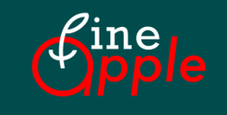
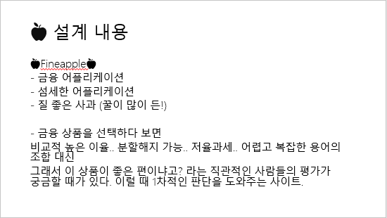
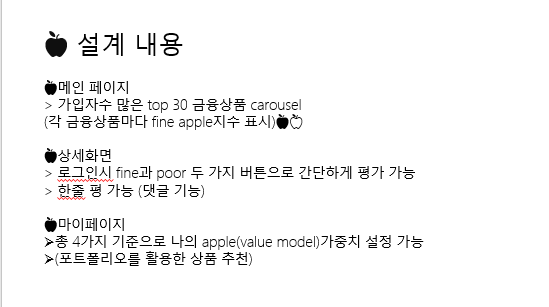
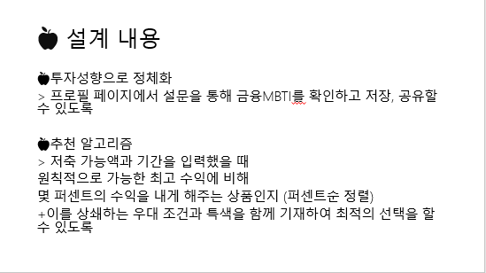
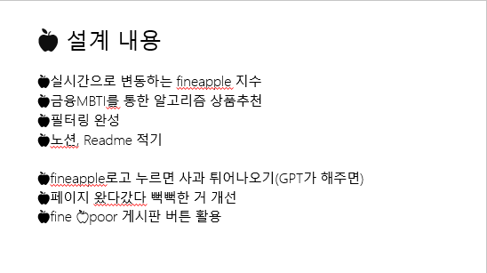
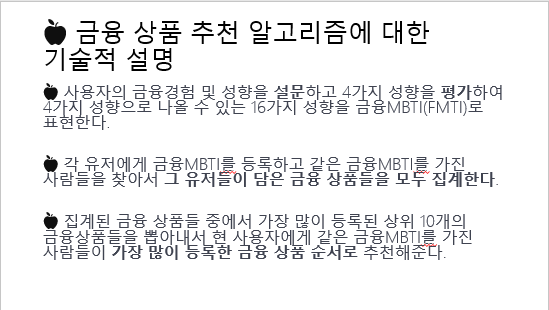

🍎🍏🍎🍏🍎🍏🍎🍏🍎🍏🍎🍏🍎🍏
# fineapple 🍎
fine financial application

🍎🍏🍎🍏🍎🍏🍎🍏🍎🍏🍎🍏🍎🍏

[https://www.rottentomatoes.com](https://www.rottentomatoes.com)
<h1> RottenTomatoes

- 옛날 공연을 보던 관객들이 연기력이 매우 나쁜 연기자들에게 토마토를 던졌던 것에서 유래

- 영화에 대한 평을 호평과 악평으로 양분하여 신선함(fresh)과 썩음(rotten)으로 표시한 뒤, 이를 종합하여 영화에 대한 총평을 내림

- 1988년 8월 19일 미국의 여러 평가자들의 평가를 모아 놓는 사이트를 목적으로 
센흐 더옹(Senh Duing)에 의해 만들어짐

- 꿀이 가득한 과일의 대명사로 사과를 생각
- Fine Apple을 탐색하는 Financial Application

